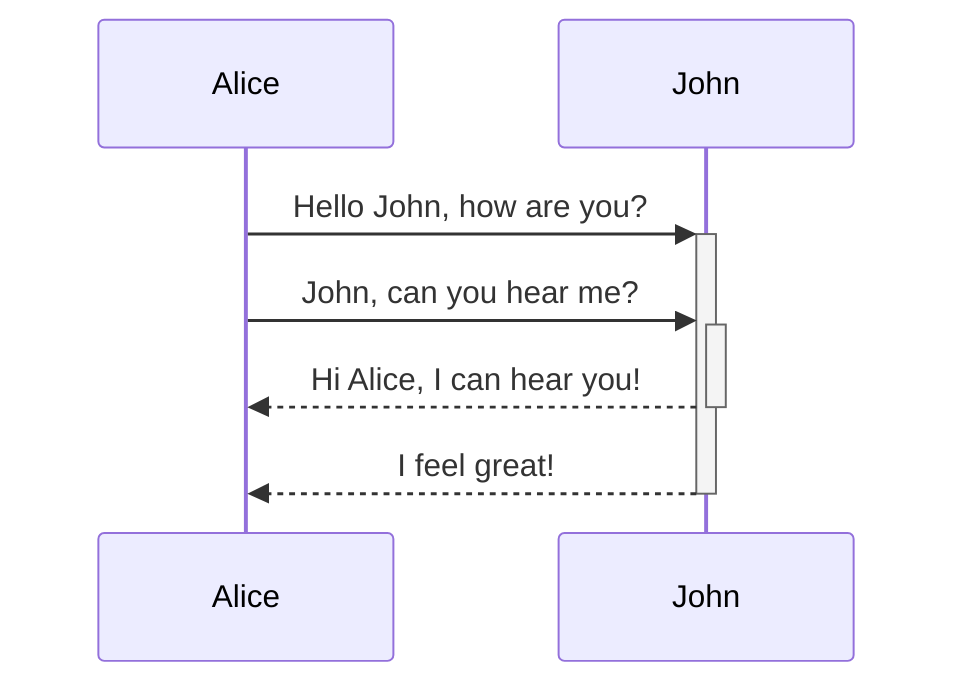

## Callout

> [!info] Default title

> [!question]+ Can callouts be _nested_?
> 
> > [!todo]- Yes!, they can. And collapsed!
> > 
> > > [!example] You can even use multiple layers of nesting.

> [!abstract] Aliases: "abstract", "summary", "tldr"

> [!info] Aliases: "info"

> [!todo] Aliases: "todo"

> [!success] Aliases: "success", "check", "done"

> [!question] Aliases: "question", "help", "faq"

> [!failure] Aliases: "failure", "missing", "fail"

> [!danger] Aliases: "danger", "error"

> [!bug] Aliases: "bug"

> [!example] Aliases: "example"

> [!quote] Aliases: "quote", "cite"

> [!tree] Aliases: "quote", "cite"


> [Fetching Title#6kdx](https://github.com/jackyzha0/quartz/blob/v4/docs/features/callouts.md


## Mermaid



## Syntax Highlighting

```js title="title…" 
export function trimPathSuffix(fp: string): string {
  fp = clientSideSlug(fp)
  let [cleanPath, anchor] = fp.split("#", 2)
  anchor = anchor === undefined ? "" : "#" + anchor
 
  return cleanPath + anchor
}
```

```js {1-3,4} 
export function trimPathSuffix(fp: string): string {
  fp = clientSideSlug(fp)
  let [cleanPath, anchor] = fp.split("#", 2)
  anchor = anchor === undefined ? "" : "#" + anchor
 
  return cleanPath + anchor
}
```

## Wikilinks

- `![[Path to image]]`: embeds an image into the page
- `![[Path to image|100x145]]`: embeds an image into the page with dimensions 100px by 145px
- `![[Path to file]]`: transclude an entire page
- `![[Path to file#anchor|Anchor]]`: transclude everything under the header `Anchor`
- `![[Path to file#^b15695|^b15695]]`: transclude block with ID `^b15695`


