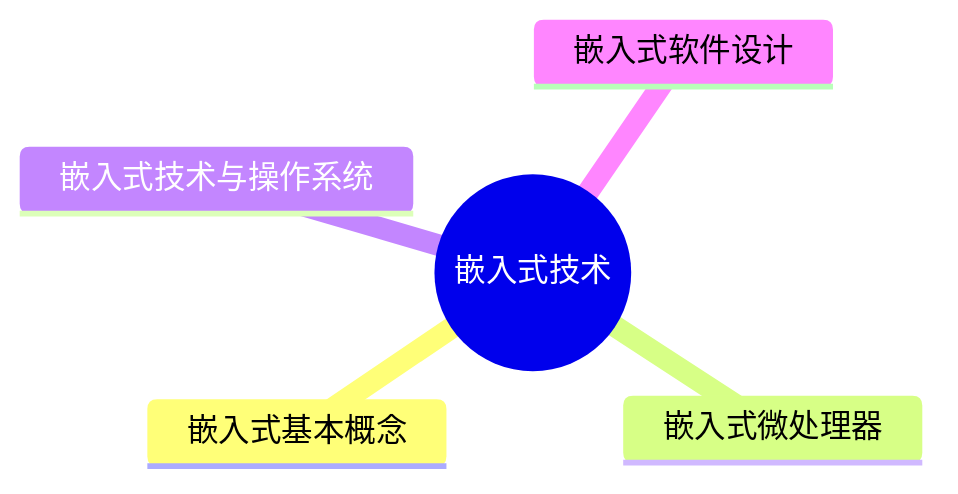

# MindMap

*** 
## 嵌入式基本概念

- **嵌入式系统：** 以应用为中心、以计算机技术为基础，并将可配置与可裁减的软、硬件、集成于一体的专用计算机系统，需要满足应用对功能、可靠性、成本、体积和功耗等方面的严格要求。一般嵌入式系统由 **嵌入式处理器、相关支撑硬件、嵌入式操作系统、支撑软件以及应用软件**组成

- **嵌入式操作系统：** 是指运行在嵌入式系统中的基础软件，主要用于管理计算机资源和应用软件。与通用操作系统不同，嵌入式操作系统应具备***实时性、可剪裁性和安全性***等特征

- **相关支撑硬件：** 是指除嵌入式处理器以外的构成系统的其他硬件，包括***存储器、定时器、总线、IO接口***以及相关专用硬件

- **嵌入式处理器：** 由于嵌入式系统一般是在恶劣的环境条件下工作，与一般处理器相比，嵌入式处理器应可抵抗恶劣环境的影响，比如高温、寒冷、电磁、加速度等环境因素。为适应恶劣环境，嵌入式处理器芯片除满足低功耗、体积小等需求外，根据不同环境需求，其工艺可分为民用、工业和军用等三个档次

### 特性

- 专用性强
- 技术融合
- 软硬一体软件为主
- 比通用计算机资源少
- 程序代码固化在非易失存储器中
- 需专门开发工具和环境
- 体积小、价格低、工艺先进、性能价格比高、系统配置要求低、实时性强
- 对安全性和可靠性的要求高
### 嵌入式系统分类

- 根据用途分类
	- 嵌入式实时系统
		- 强实时系统和弱实时系统
	- 嵌入式非实时系统
- 根据安全性分类
	- 安全攸关系统和非安全攸关系统
### 嵌入式软件的主要特点

｜可剪裁性｜可配置性｜强实时性  ｜安全性｜可靠性｜高确定性

*** 
## 嵌入式微处理器

### 嵌入式微处理器体系结构

#### 冯诺依曼结构

- **冯诺依曼结构：** 传统计算机采用冯·诺依曼(VonNeumann)结构，也称普林斯顿结构，是一种将程序指令存储器和数据存储器合并在一起的存储器结构
![[content/system architecture/image/冯诺依曼结构.png]]
- 冯·诺依曼结构的**计算机程序和数据共用一个存储空间**，程序指令存储地址**和**数据存储地址**指向**同一个存储器的不同物理位置
- 冯·诺依曼结构采用**单一的地址及数据总线**，程序指令和数据的宽度相同

#### 哈佛结构

**哈佛结构：** 是一种并行体系结构，它的主要特点是将程序和数据存储在不同的存储空间中，即程序存储器和数据存储器是两个相互独立的存储器，每个存储器独立编址、独立访问
![[content/system architecture/image/哈弗结构.png]]
- 哈佛结构中，与两个存储器相对应的是系统中的两套独立的地址总线和数据总线
- 哈佛结构中，这种分离的程序总线和数据总线可允许在一个机器周期内同时获取指令字(来自程序存储器)和操作数(来自数据存储器)，从而提高了执行速度，使数据的吞吐率提高了1倍。但这不意味着可以在一个机器周期内多次访问存储器

<!-- 

### 嵌入式微处理器分类
### 多核处理器结构

*** 
## 嵌入式技术与操作系统
*** 
## 嵌入式软件设计 -->
