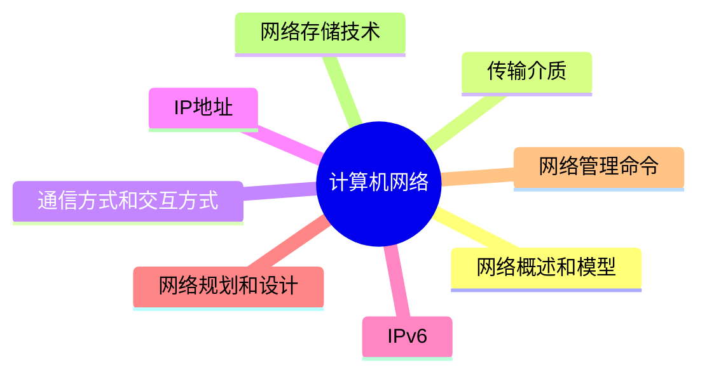

# MindMap

***
## 网络概述和模型

#### 基本概念

- **计算机网络的功能：** 数据通信、资源共享、管理集中化、实现分布式处理、负载均衡

**网络指标**

- **网络性能指标：** 速率、带宽(频带宽度或传送线路速率)、吞吐量、时延、往返时间、利用率
- **网络非性能指标：** 费用、质量、标准化、可靠性、可扩展性、可升级性、易管理性和可维护性
- **Web服务器性能指标**：主要有请求响应时间、事务响应时间、并发用户数、吞吐量、资源利用率、每秒钟系统能够处理的交易或者事务的数量等

**信道：** 分为物理信道和逻辑信道

- 物理信道：由传输介质和设备组成，根据传输介质的不同，分为无线信道和有线信道
- 逻辑信道：是指在数据发送端和接收端之间存在的一条虚拟线路，可以是有连接的或无连接的。逻辑信道以物理信道为载体

- **发信机进行的信号处理：** 包括信源编码、信道编码、交织、脉冲成形和调制
- **收信机进行的信号处理**：包括解调、采样判决、去交织、信道译码和信源译码

**默认网关**：一台主机可以有多个网关

- 默认网关的意思是一台主机如果找不到可用的网关，就把数据包发给默认指定的网关，由这个网关来处理数据包
- 现在主机使用的网关，一般指的是默认网关
- 默认网关的IP地址必须与本机IP地址在同一个网段内，即同**网络号**

**冲突域和广播域:** 路由器可以阻断广播域和冲突域，交换机只能阻断冲突域

- 一个路由器下可以划分多个广播域和多个冲突域
- 一个交换机下整体是一个广播域，但可以划分多个冲突域
- 物理层设备集线器下整体作为一个冲突域和一个广播域

#### 网络结构

- 总线型(利用率低、干扰大、价格低)
- 星型(交换机形成的局域网、中央单元负荷大)，eg：办公室局域网是星型拓扑结构，中间节点就是交换机，一旦交换机损坏，整个网络都瘫痪了
- 环型(流动方向固定、效率低扩充难)
- 树型(总线型的扩充、分级结构)
- 分布式(任意节点连接、管理难成本高)

#### 网络协议

**以太网规范IEEE802.3是重要的局域网协议**

> [!info] **无线局域网WLAN技术标准：**IEEE802.11

| 规范名称         | 描述    | 速度       | 传输介质       |
| ------------ | ----- | -------- | ---------- |
| IEEE 802.3   | 标准以太网 | 10Mb/s   | 传输介质为细同轴电缆 |
| IEEE 802.3u  | 快速以太网 | 100Mb/s  | 双绞线        |
| IEEE 802.3z  | 干兆以太网 | 1000Mb/s | 光纤或双绞线  |
| IEEE 802.3ae | 万兆以太网 | 10Gb/s   | 光纤         |

**参见的网络协议**

> [!tip] TCP/IP协议网络协议三要素： 语法、语义、时序
> 
> 基本特性（逻辑编址、路由选择、域名解析协议、错误检测和流量控制）

**网络协议对应端口**

| 名称     | 协议全称                                | 描述                                             | 端口             | 位于网络分层的那层 |
| ------ | ----------------------------------- | ---------------------------------------------- | -------------- | --------- |
| IP     | Internet Protocol                   | 网络层最重要的核心协议，在源地址和目的地址之间传送数据报，无连接、不可靠           | ❌              | 网络层协议     |
| ICMP   | Internet Control Message Protocol   | 用于在IP主机、路由器之间传递控制消息。控制消息包括网络通不通、主机是否可达、路由是否可用等 | ❌              | 网络层协议     |
| ARP    | Address Resolution Protocol         | 地址解析协议，将IP地址转换为物理地址（MAC地址）                     | ❌              | 网络层协议     |
| RARP   | Reverse Address Resolution Protocol | 地址反解析协议，将物理地址转换为IP地址                           | ❌              | 网络层协议     |
| IGMP   | Internet Group Management Protocol  | 允许因特网中的计算机参加多播，向相邻多播路由器报告多播组成员的协议，支持组播         | ❌              | 网络层协议     |
| TCP    | Transmission Control Protocol       | 传输层协议，提供可靠的、面向连接的、全双工的数据传输服务，常用于数据量小但可靠性要求高的场合 | 80, 443        | 传输层协议     |
| UDP    | User Datagram Protocol              | 无连接、不可靠的传输协议，速度快，常用于数据量大但对可靠性要求不高的场合           | 53, 67-68      | 传输层协议     |
| FTP    | File Transfer Protocol              | 文件传输协议，提供可靠的双向文件传输服务                           | 20(数据), 21（控制） | 应用层协议     |
| HTTP   | Hypertext Transfer Protocol         | 超文本传输协议，用于从WWW服务器传输超文本到本地浏览器                   | 80             | 应用层协议     |
| HTTPS  | Hypertext Transfer Protocol Secure  | 基于SSL加密的超文本传输协议，确保网页传输的安全性                     | 443            | 应用层协议     |
| SMTP   | Simple Mail Transfer Protocol       | 简单邮件传输协议，用于源地址到目的地址的邮件传输                       | 25             | 应用层协议     |
| POP3   | Post Office Protocol version 3      | 邮局协议第三版，用于邮件接收                                 | 110            | 应用层协议     |
| Telnet | Telnet                              | 远程登录协议，是因特网远程连接服务的标准协议和主要方式                    | 23             | 应用层协议     |
| TFTP   | Trivial File Transfer Protocol      | 小文件传输协议，不可靠但开销较小                               | 69             | 应用层协议     |
| SNMP   | Simple Network Management Protocol  | 简单网络管理协议，用于网络管理系统监测连接到网络的设备                    | 161            | 应用层协议     |
| DHCP   | Dynamic Host Configuration Protocol | 动态主机配置协议，基于C/S模型，为主机动态分配IP地址                   | 67-68          | 应用层协议     |
| DNS    | Domain Name System                  | 域名解析协议，将域名解析为IP地址                              | 53             | 应用层协议     |

#### 交换机

**交换机功能：**

- 集线功能：提供大量可供线缆连接的端口达到部署星状拓扑网络的目的
- 中继功能：在转发帧时重新产生不失真的电信号
- 桥接功能：在内置的端口上使用相同的转发和过滤逻辑
- 隔离冲突域功能：将部署好的局域网分为多个冲突域，而每个冲突域都有自己独立的带宽，以提高交换机整体宽带利用效率

#### 路由器

> [!note] 路由器工作在OSI七层协议中的第3层，即网络层

**路由器功能：**

- 异种网络互连：比如具有异种子网协议的网络互连
- 子网协议转换：不同子网间包括局域网和广域网之间的协议转换
- 数据路由：即将数据从一个网络依据路由规则转发到另一个网络
- 速率适配：利用缓存和流控协议进行适配 
- 隔离网络：防止广播风暴，实现防火墙 
- 报文分片和重组：超过接口的MTU报文被分片，到达目的地之后的报文被重组
- 备份、流量控制：如主备线路的切换和复杂流量控制等

	**路由协议：** 路由协议可分`内部网关协议(IGP)`和`外部网关协议(EGP)`两类

***
## 传输介质

**双绞线：** 将多根铜线按规则缠绕在一起，能够减少干扰；分为无屏蔽双绞线UTP和屏蔽双绞线STP，都是由一对铜线簇组成。也即我们常说的网线，双绞线的传输距离在100m以内

- **无屏蔽双绞线UTP：** 价格低，安装简单，可靠性相对较低，分为CAT3(3类UTP，速率为10Mbps)、CAT4(4类UTP，与3类差不多，无应用)、CAT5(5类UTP，速率为100Mbps，用于快速以太网)、CAT5E(超5类UTP，速率为1000Mbps)、CAT6(6类UTP，用来替代CAT5E，速率也是1000Mbps)
- **屏蔽双绞线STP：** 比之UTP增加了一层屏蔽层，可以有效的提高可靠性，但对应的价格高，安装麻烦，一般用于对传输可靠性要求很高的场合

**光纤：** 由纤芯和包层组成，传输的光信号在纤芯中传输，然而从PC端出来的信号都是电信号，要经过光纤传输的话，就必须将电信号转换为光信号

- **多模光纤MMF**：纤芯半径较大，因此可以同时传输多种不同的信号，光信号在光纤中以全反射的形式传输，采用发光二极管LED为光源，成本低，但是传输的效率和可靠性都较低，适合于短距离传输，其传输距离与传输速率相关，速率为100Mbps时为2KM，速率为1000Mbps时为550m
- **单模光纤SMF：** 纤芯半径很小，一般只能传输一种信号，采用激光二极管LD作为光源，并且只支持激光信号的传播，同样是以全反射形式传播，只不过反射角很大，看起来像一条直线，成本高，但是传输距离远，可靠性高。传输距离可达5KM

**无线信道：** 分为无线电波和红外光波

网线：又分为直通线和交叉线，直通线就是网线两头采用同一种标准，交叉线就是网线两头采用不同的标准

***
## 通信方式和交互方式
***
## IP地址

**IP地址的表示：** 机器中存放的IP地址是32位的二进制代码，每隔8位插入一个空格，可提高可读性，为了便于理解和设置，一般会采用点分十进制方法来表示：将32位二进制代码每8位二进制转换成十进制，就变成了4个十进制数，而后在每个十进制数间隔中插入

**在逻辑上，这32位IP地址分为**网络号**和**主机号，依据网络号位数的不同

子网掩码：网络号和子网号都为1，主机号都为0
***
## IPv6

> IPv6是**为了解决IPv4地址数不够用的情况而提出的设计方案**

#### IPv6特性

- IPv6地址长度为128位，地址空间增大了2^96倍
- 灵活的IP报文头部格式，使用一系列固定格式的扩展头部取代了IPv4中可变长度的选项字段。IPv6中选项部分的出现方式也有所变化，使路由器可以简单撸过选项而不做任何处理，加快了报文处理速度
- IPv6简化了报文头部格式，加快报文转发，提高了吞吐量
- 提高安全性，身份认证和隐私权是IPv6的关键特性
- 支持更多的服务类型
- 允许协议继续演变，增加新的功能，使之适应未来技术的发展

#### 底层技术

- 双协议栈：主机同时运行IPv4和IPv6两套协议栈，同时支持两套协议，一般来说IPv4和IPv6地址之间存在某种转换关系，如IPv6的低32位可以直接转换为IPv4地址，实现互相通信
- 隧道技术：这种机制用来在IPv4网络之上建立一条能够传输IPv6数据报的隧道，例如可以将IPv6数据报当做IPv4数据报的数据部分加以封装，只需要加一个IPv4的首部，就能在IPv4网络中传输IPv6报文
- 翻译技术：利用一台专门的翻译设备(如转换网关)，在纯IPv4和纯IPv6网络之间转换IP报头的地址，同时根据协议不同对分组做相应的语义翻译，从而使纯IPv4和纯IPv6站点之间能够透明通信
***
## 网络规划和设计

#### 层次化局域网模型（三层模型）

三层网络模型将网络划分为：接入层、汇聚层和核心层，每一层都有着特定的作用

- **核心层：** 提供不同区域之间的最佳路由和高速数据传送
- **汇聚层：** 将网络业务连接到接入层，并且实施与安全、流量、负载和路由相关的策略
- **接入层：** 为用户提供了在本地网段访问应用系统的能力，还要解决相邻用户之间的互访需要，接入层要负责一些用户信息(例如用户IP地址、MAC地址和访问日志等)的收集工作和用户管理功能(包括认证和计费等)

***
## 网络管理命令

#### Ipconfig

> 用于显示和管理 Windows 计算机的网络接口配置信息

- `ipconfig`：显示当前计算机的基础网络配置信息（IP地址、子网掩码、默认网关）。
- `ipconfig /all`：显示所有网络适配器的详细信息，包括 MAC 地址、DHCP 状态等。
- `ipconfig /release`：释放当前分配的 IP 地址。
- `ipconfig /renew`：重新获取 IP 地址。

#### Ping

> 测试与目标主机的连通性

- `ping 8.8.8.8`：测试与 Google 公共 DNS 的连通性。
- `ping -t google.com`：持续发送 ping 请求，直到手动停止。
- `ping -n 10 google.com`：发送指定次数的 ping 请求（此处为 10 次）。
#### Arp

> 管理和显示地址解析协议 (ARP) 缓存表

- `arp -a`：显示当前的 ARP 缓存条目，包括 IP 地址和 MAC 地址映射。
- `arp -d 192.168.1.1`：删除指定 IP 地址的 ARP 缓存条目。
- `arp -s 192.168.1.100 00-aa-bb-cc-dd-ee`：手动将 IP 地址与 MAC 地址静态映射。

#### Netstat

> 显示活动的网络连接、路由表和协议统计信息

- `netstat`：显示所有活动的网络连接。
- `netstat -an`：显示所有连接及其状态（包括监听的端口号）。
- `netstat -r`：显示路由表。
- `netstat -b`：显示与每个连接相关的可执行文件。
#### Tracert

> 跟踪数据包从源到目的地所经过的每一跳的路由路径。

- `tracert google.com`：显示从本地计算机到 Google 服务器的路由。
- `tracert -d google.com`：不解析 IP 地址对应的域名，加快追踪速度。
#### Pathping

> 结合了 `ping` 和 `tracert` 的功能，测量每个路由跳点的网络延迟和丢包率。

- `pathping google.com`：分析本地到 Google 服务器的每一跳网络质量。
- `pathping -n google.com`：跳过 IP 地址解析以加速输出。
#### Route

> 显示并管理本地路由表。

- `route print`：显示路由表。
- `route add 192.168.1.0 mask 255.255.255.0 192.168.1.1`：添加静态路由。
- `route delete 192.168.1.0`：删除指定的路由条目。
#### Net

> 管理网络资源、计算机、用户和服务。

- `net use`：管理网络驱动器映射和共享文件夹连接。
- `net share`：查看或创建共享文件夹。
- `net start`：查看和启动本地服务。
- `net stop`：停止某个服务。
#### Nslookup

> 用于查询 DNS 服务器，获取域名解析的信息。

- `nslookup google.com`：查询 Google 域名的 IP 地址。
- `nslookup`：进入交互模式，手动输入查询命令。
- `nslookup -type=mx example.com`：查询指定域名的 MX 记录（邮件服务器）。

***
## 网络存储技术

#### 独立硬盘冗余阵列

>**独立硬盘冗余阵列**（**RAID**, **R**edundant **A**rray of **I**ndependent **D**isks），旧称**廉价磁盘冗余阵列**（**R**edundant **A**rray of **I**nexpensive **D**isks），简称**磁盘阵列**。利用虚拟化存储技术把多个硬盘组合起来，成为一个或多个硬盘阵列组，目的为提升性能或资料冗余，或是两者同时提升 — From Wikipedia

- **RAID0：** 将数据分散的存储在不同磁盘中，磁盘利用率100%，访问速度最快，但是没有提供冗余和错误修复技术
- **RAID1：** 在成对的独立磁盘上产生互为备份的数据，增加存储可靠性，可以纠错，但磁盘利用率只有50%
- **RAID2：** 将数据条块化的分布于不同硬盘上，并使用**海明码校验**
- **RAID3：** 使用奇偶校验，并用单块磁盘存储奇偶校验信息(可靠性低于RAID5)
- **RAID5：** 在所有磁盘上交叉的存储数据及奇偶校验信息(所有校验信息存储总量为一个磁盘容量，但分布式存储在不同的磁盘上)，读/写指针可同时操作
- **RAIDO+1：** 是两个RAID0，若一个磁盘损坏，则当前RAID0无法工作，即有一半的磁盘无法工作
- **RAID1+0：**(是两个RAID1，不允许同一组中的两个磁盘同时损坏)与RAID1原理类似，磁盘利用率都只有50%，但安全性更高

#### 网络存储技术

- **直接附加存储吃（DAS）**
	- 定义：是指将存储设备通过SCSI接口直接连接到一台服务器上使用，其本身是硬件的堆叠，存储操作依赖于服务器，不带有任何存储操作系统。
	- 存在问题：在传递距离、连接数量、传输速率等方面都受到限制。容量难以扩展升级；数据处理和传输能力降低；服务器异常会波及存储器

- **网络附加存储(NAS)**
	- 定义：通过网络接口与网络直接相连，由用户通过网络访问，有独立的存储系统
	- NAS存储设备类似于一个专用的文件服务器，去掉了通用服务器大多数计算功能，而仅仅提供文件系统功能。
	- 以数据为中心，将存储设备与服务器分离，其存储设备在功能上完全独立于网络中的主服务器。
	- 客户机与存储设备之间的数据访问不再需要文件服务器的干预，同时它允许客户机与存储设备之间进行直接的数据访问，所以不仅响应速度快，而且数据传输速率也很高。
	- NAS的性能特点是进行小文件级的共享存取；支持即插即用；可以很经济的解决存储容量不足的问题，但难以获得满意的性能

- **存储区域网(SAN)**
	- SAN是通过专用交换机将磁盘阵列与服务器连接起来的高速专用子网
	- 它没有采用文件共享存取方式，而是采用块(block)级别存储
	- SAN是通过专用高速网将一个或多个网络存储设备和服务器连接起来的专用存储系统
	- SAN最大特点是将存储设备从传统的以太网中分离了出来，成为独立的存储区域网络SAN的系统结构
	- 根据数据传输过程采用的协议，其技术划分为FCSAN(光纤通道)、IPSAN(IP网络)和IBSAN(无线带宽)技术

***

## Reference

- [Site Unreachable](https://www.eet-china.com/mp/a97027.html)
- [计算机网络知识和TCPIP常见问题-阿里云开发者社区](https://developer.aliyun.com/article/1426325)