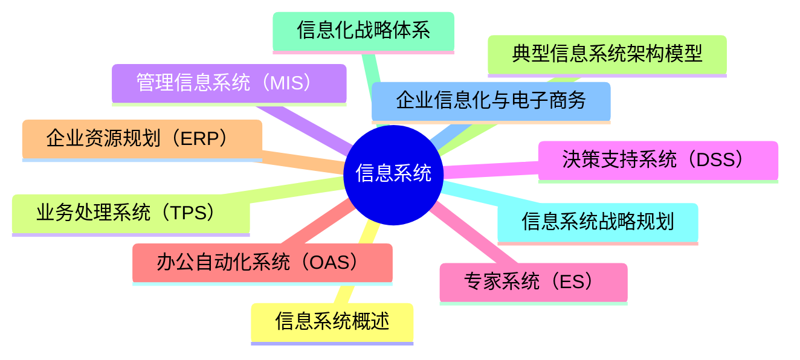

---
aliases:
  - 信息系统
tags:
  - system
  - comput
draft: true
date:
---
# MindMap



*** 
## 信息系统概述

- **信息系统：** 是由[[01 计算机系统|计算机硬件]]、网络和通信设备、计算机软件、信息资源、信息用户和规章制度组成的以处理信息流为目的的人机一体化系统

- **信息系统的5个基本功能：** 输入、存储、处理、输出和控制

- **信息系统建设的原则：** 高层管理人员介入原则、用户参与开发原则、自顶向下规划原则、工程化原则、其他原则(创新性，整体性，发展性，经济性等)

- **信息系统开发方法：** [[结构化方法（S）]]、[[原型化方法|原型化方法]]、[[OOP（Object-oriented programming）|面向对象]]方法、[[面向服务（SO, Service-Oriented）|面向服务]]的方法

- 

*** 
## 业务处理系统（TPS）
*** 
## 管理信息系统（MIS）
*** 
## 決策支持系统（DSS）
*** 
## 专家系统（ES）
*** 
## 办公自动化系统（OAS）
*** 
## 企业资源规划（ERP）
*** 
## 典型信息系统架构模型
*** 
## 信息化战略体系
*** 
## 信息系统战略规划
*** 
## 企业信息化与电子商务

***
## Reference

```mermaid
graph LR
    A[] --> B[]
    B --> C[]
    C --> D[]
    D --> E[]
    E --> F[]
    F --> G[]

	B -.-> |O:N| D
```
