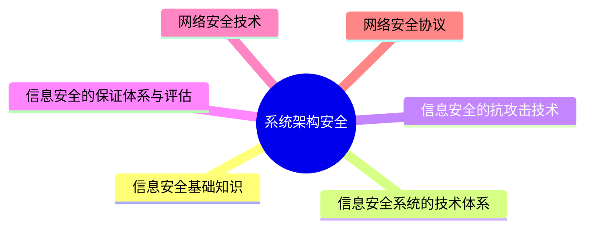

---
aliases:
  - 系统安全
tags:
  - system
  - comput
draft: false
date:
---
# MindMap

***
## 信息安全基础知识

**信息安全包括5个基本要素**：机密性、完整性、可用性、可控性与可审查性

- **机密性**：确保信息不暴露给未授权的实体或进程
- **完整性**：只有得到允许的人才能修改数据，井且能够判别出数据是否己被篡改
- **可用性**：得到授权的实体在需要时可访问数据，即攻击者不能占用所有的资源而阻碍授权者的工作
- **可控性**：可以控制授权范围内的信息流向及行为方式
- **可审查性**：对出现的信息安全问题提供调查的依据和手段

**信息安全的范围包括：** 设备安全、数据安全、内容安全和行为安全

**信息的存储安全包：** 括信息使用的安全、系统安全监控、计算机病毒防治、数据的加密和防止非法的攻击等

**网络安全隐患体现在：** 物理安全性、软件安全漏洞、不兼容使用安全漏洞、选择合适的安全哲理

**网络安全威胁：** 非授权的访问、信息泄露或丢失、破坏数据完整性、拒绝服务攻击、利用网络传播病毒

**安全措施的目标：** 访问控制、认证、完整性、审计、保密
*** 
## 信息安全系统的技术体系

**技术体系：** 从实现技术上来看，信息安全系统涉及基础安全设备、计算机网络安全、操作系统安全、数据库安全、终端设备安全等多方面技术

*** 
## 信息安全的抗攻击技术

#### 密钥生成需要考虑

> 增大密钥空间、选择强钥(复杂的)、 密钥的随机性(使用随机数)

**外部用户针对网络连接发动拒绝服务攻击主要有以下几种模式：** 消耗资源、破坏或更改配置信息、  物理破坏或改变网络部件、利用服务程序中的处理错误使服务失效

**分布式拒绝服务DDoS攻击是对传统DoS攻击的发展，攻击者首先侵入并控制一些计算机，然后控制这些计算机同时向一个特定的目标发起拒绝服务攻击。克服了传统DOS受网络资源的限制和**V隐蔽性两大缺点
*** 
## 信息安全的保证体系与评估

>[!info] GB17859—999标准规定了计算机系统安全保护能力的五个等级

第一级：用户自主保护级
第二级：系统审计保护级
第三级：安全标记保护级
第四级：结构化保护级
第五级：访问验证保护
## 网络安全技术

- **防火墙**：是在内部网络和外部因特网之间增加的一道安全防护措施，分为网络级防火墙和应用级防火墙
	- 网络级防火墙层次低，但是效率高，因为其使用包过滤和状态监测手段
	- 应用级防火墙，层次高，效率低，因为应用级防火墙会将网络包拆开，具体检查里面的数据是否有问题，会消耗大量时间，造成效率低下，但是安全强度高
- **入侵检测系统IDS：** 对来自内网的直接攻击无能为力，此时就要用到入侵检测IDS技术，位于防火墙之后的第二道屏障，作为防火墙技术的补充
- **入侵检测系统IDS原理：** 监控当前系统/用户行为，使用入侵检测分析引擎进行分析，这里包含一个知识库系统，囊括了历史行为、特定行为模式等操作，将当前行为和知识库进行匹配，就能检测出当前行为是否是入侵行为，如果是入侵，则记录证据并上报给系统和防火墙，交由它们处理
	- **对IDS的部署，唯一的要求是：** IDS应当挂接在所有所关注流量都必须流经的链路上
	- IDS在交换式网络中的位置一般选择在
		- 尽可能靠近攻击源
		- 尽可能靠近受保护资源
- **入侵防御系统IPS：** IDS和防火墙技术都是在入侵行为已经发生后所做的检测和分析，而IPS是能够提前发现入侵行为，在其还没有进入安全网络之前就防御。串联接入网络，因此可以自动切换网络
	- 在安全网络之前的链路上挂载入侵防御系统IPS,可以实时检测入侵行为，并直接进行阻断，这是与IDS的区别
- **杀毒软件：** 用于检测和解决计算机病毒，与防火墙和IDS要区分，计算机病毒要靠杀毒软件，防火墙是处理网络上的非法攻击
- **蜜罐系统：** 伪造一个蜜罐网络引诱黑客攻击，蜜罐网络被攻击不影响安全网络，并且可以借此了解黑客攻击的手段和原理，从而对安全系统进行升级和优化

  
## 网络安全协议

- SSL协议：安全套接字协议，被设计为加强Web安全传输(HTTP/HTTPS/)的协议，安全高，和HTTP结合之后，形成HTTPS安全协议，端口号为443.
- SSH协议：安全外壳协议，被设计为加强Telnet/FTP安全的传输协议
- SET协议：安全电子交易协议主要应用于B2C模式(电子商务)中保障支付信息的安全性。SET协议本身比较复杂，设计比较严格，安全性高，它能保证信息传输的机密性、真实性、完整性和不可否认性。SET协议是PKI框架下的一个典型实现，同时也在不断升级和完善，如SET2.0将支持借记卡电子交易
- Kerberos协议：是一种网络身份认证协议，该协议的基础是基于信任第三方，它提供了在开放型网络中进行身份认证的方法，认证实体可以是用户也可以是用户服务。这种认证不依赖宿主机的操作系统或计算机的IP地址，不需要保证网络上所有计算机的物理安全性，并且假定数据包在传输中可被随机窃取和篡改

