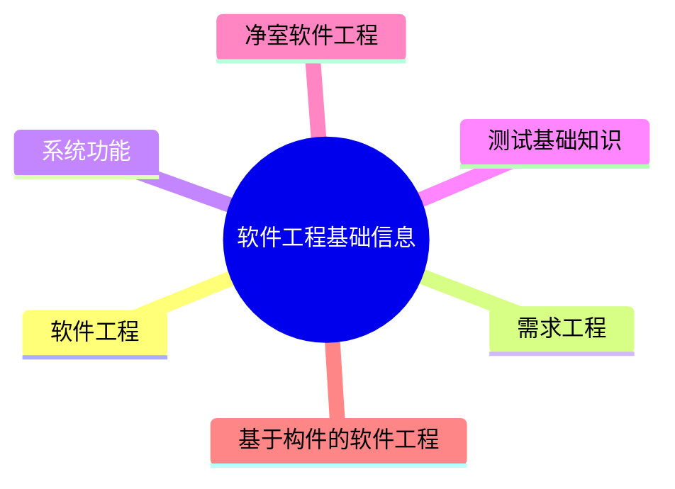

---
aliases:
  - 软件工程
tags:
  - system
  - comput
draft: false
date:
---
# MindMap


***
## 软件工程

**软件开发生命周期**

- **软件定义时期：** 包括可行性研究和详细需求分析过程，任务是确定软件开发工程必须完成的总目标，具体可分成问题定义、可行性研究、需求分析等
- **软件开发时期：** 就是软件的设计与实现，可分成概要设计、详细设计、编码、测试等
- **软件运行和维护：** 就是把软件产品移交给用户使用

**软件系统的文档**：可以分为**用户文档**和**系统文档**两类，用户文档主要描述系统功能和使用方法，并不关系这些功能是怎样实现的；系统文档描述系统设计、实现和测试等各方面的内容

**软件工程过程**：是指为获得软件产品，在软件工具的支持下由软件工程师完成的一系列软件工程活动，包括以下4个方面

- P(Plan) 软件规格说明：规定软件的功能及其运行时的限制
- D(Do) 软件开发：开发出满足规格说明的软件
- C(Check) 软件确认：确认开发的软件能够满足用户的需求
- A(Action) 软件演进：软件在运行过程中不断改进以满足客户新的需求

**软件系统工具**：通常可以按软件过程活动将软件工具分为软件开发工具、软件维护工具、软件管理和软件支持工具

***
## 需求工程

##### 软件需求

软件需求是指用户对系统在功能、行为、性能、设计约束等方面的期望。是指用户解决问题或达到目标所需的条件或能力，是系统或系统部件要满足合同、标准、规范或其他正式规定文档所需具有的条件或能力，以及反映这些条件或能力的文档说明分为需求开发和需求管理两大过程

- 业务需求
- 用户需求
- 系统需求
##### 需求获取

需求获取是一个确定和理解不同的项目干系人的需求和约束的过程

##### 需求分析

需要分析人员把杂乱无章的用户要求和期望转化为用户需求，**一个好的需求应该具有无二义性、完整性、一致性、可测试性、确定性、可跟踪性、正确性、必要性等特性**

**需求分析的任务:**
- 绘制系统上下文范围关系图  
- 创建用户界面原型  
- 分析需求的可行性  
- 确定需求的优先级  
- 为需求建立模型  
- 创建数据字典  
- 使用QFD(质量功能部署)

**结构化的需求分析的三大模型：** 功能模型(数据流图)、行为模型(状态转换图)、数据模型(E-R图)以及数据字典

**结构化的需求分析的结构化特点：** 自顶向下，逐步分解，面向数据

##### 需求定义

**需求定义方法**：

- **严格定义**：也称为预先定义，需求的严格定义建立在以下的基本假设之上：所有需求都能够被预先定义。开发人员与用户之间能够准确而清晰地交流。采用图形(或文字)可以充分体现最终系统

- **原型方法**：迭代的循环型开发方式，需要注意的问题：并非所有的需求都能在系统开发前被准确地说明。项目干系人之间通常都存在交流上的困难，原型提供了克该服困难的一个手段。特点：需要实际的、可供用户参与的系统模型。有合适的系统开发环境。反复是完全需要和值得提倡的，需求一旦确定，就应遵从严格的方法

**软件需求规格说明书SRS：** 是需求开发活动的产物，编制该文档的目的是使项目干系人与开发团队对系统的初始规定有一个共同的理解，使之成为整个开发工作的基础。SRS是软件开发过程中最重要的文档之一，对于任何规模和性质的软件项目都不应该缺少
##### 需求验证

**求验证也称为`需求确认`**  ，目的是与用户一起确认需求无误，对需求规格说明书SAS进行评审和测试，包括两个步骤：
- 需求评审：正式评审和非正式评审  
- 需求测试：设计概念测试用例

**需求验证通过后**，要请用户签字确认，作为验收标准之一，此时，这个需求规格说明书就是`需求基线`，不可以再随意更新，如果需要更改必须走需求变更流程
##### 需求管理

**定义需求基线：** 通过了评审的需求说明书就是需求基线，下次如果需要变更需求，就需要按照流程来一步步进行

**需求变更和风险：** 主要关心需求变更过程中的需求风险管理，带有风险的做法有：无足够用户参与、忽略了用户分类、用户需求的不断增加、模棱两可的需求、不必要的特性、过于精简的SRS、不准确的估算
*** 
## 系统设计

##### 处理流程设计

- **程序流程图(ProgramFlowDiagram,PFD)** 用一些图框表示各种操作，它独立于任何一种程序设计语言，比较直观、清晰，易于学习掌握。任何复杂的程序流程图都应该由顺序、选择和循环结构组合或嵌套而成
- **IPO图**：是流程描述工具，用来描述构成软件系统的每个模块的输入、输出和数据加工
- **N-S图**：容易表示嵌套和层次关系，并具有强烈的结构化特征。但是当问题很复杂时，N-S图可能很大，因此不适合于复杂程序的设计
- **问题分析图(PAD)**：是一种支持结构化程序设计的图形工具。PAD具有清晰的逻辑结构、标准化的图形等优点，更重要的是，它引导设计人员使用结构化程序设计方法，从而提高程序的质量
- **业务流程重组BPR**：是对企业的业务流程进行根本性的再思考和彻底性的再设计，从而获得可以用诸如成本、质量、服务和速度等方面的业绩来衡量的显著性的成就。BPR设计原则、系统规划和步骤如下图所示
- **业务流程管理BPM** 是一种以规范化的构造端到端的卓越业务流程为中心，以持续的提高组织业务绩效为目的的系统化方法
##### 系统设计

**系统设计主要目的：** 为系统制定蓝图，在各种技术和实施方法中权衡利弊，精心设计，合理地使用各种资源，最终勾画出新系统的详细设计方法
**系统设计的主要内容：** 概要设计、详细设计

**系统设计方法：** 结构化设计方法，面向对象设计方法

**概要设计基本任务：** 又称为系统总体结构设计，是将系统的功能需求分配给软件模块，确定每个模块的功能和调用关系，形成软件的模块结构图，即系统结构图

**详细设计的基本任务：** 模块内详细算法设计、模块内数据结构设计、数据库的物理设计、其他设计(代码、输入/输出格式、用户界面)、编写详细设计说明书、评审

**系统设计基本原理:**  抽象化；自顶而下，逐步求精；信息隐蔽；模块独立(高内聚，低耦合)

**系统结构图(SC)又称为模块结构图**，它是软件概要设计阶段的工具，反映系统的功能实现和模块之间的联系与通信，包括各模块之间的层次结构，即反映了系统的总体结构
##### 人际界面设计

 **人机界面设计的三大原则：** 置于用户控制之下、减少用户的记忆负担、保持界面的一致性

*** 
## 测试基础知识

**测试过程中程序执行状态：** 动态测试、静态测试

具体实现算法细节和系统内部结构的相关情况为根据可分`黑盒测试`、`白盒测试`和`灰盒测试`

**动态测试,程序运行时测试，分为:**  

- 黑盒测试法：功能性测试，不了解软件代码结构，根据功能设计用例，测试软件功能。  
- 白盒测试法：结构性测试，明确代码流程，根据代码逻辑设计用例，进行用例覆盖。  
- 灰盒测试法：即既有黑盒，也有白盒

**静态测试,程序静止时，即对代码进行人工审查，分为:**  

- 桌前检查：程序员检查自己编写的程序，在程序编译后，单元测试前 
- 代码审查：由若干个程序员和测试人员组成评审小组，通过召开程序评审会来进行审查。
- 代码走查：也是采用开会来对代码进行审查，但并非简单的检查代码，而是由测试人员提供测试用例，让程序员扮演计算机的角色，手动运行测试用例，检查代码逻辑

**静态测试,程序静止时，即对代码进行人工审查，分为:**

- 桌前检查
- 代码检查
- 代码走差

**单元测试：**也称为模块测试，测试的对象是可独立编译或汇编的程序模块、软件构件或OO软件中的类(统称为模块),测试依据是软件详细设计说明书
<!-- *** 
## 净室软件工程
*** 
## 基于构件的软件工程
***
## Reference

```mermaid
graph LR
    A[] --> B[]
    B --> C[]
    C --> D[]
    D --> E[]
    E --> F[]
    F --> G[]

	B -.-> |O:N| D
``` -->
