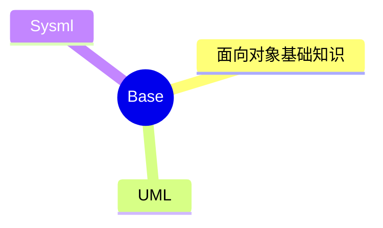

---
aliases:
  - 面向对象
tags:
  - system
  - comput
  - 方法论
  - 开发思想
draft: false
date:
---
# MindMap

*** 
## 面向对象基础知识

- **对象：** 由数据及其操作所构成的封装体，是系统中用来描述客观事务的一个实体，是构成系统的一个基本单位。一个对象通常可以由**对象名、属性和方法**3个部分组成

- **类：** 现实世界中实体的形式化描述，类将该实体的属性(数据)和操作(函数)封装在一起。对象是类的实例，类是对象的模板。类可以分为三种：实体类、接口类(边界类)和控制类
	- 实体类：的对象表示现实世界中真实的实体，如人、物等
	- 接口类(边界类)的对象为用户提供一种与系统合作交互的方式，分为人和系统两大类，其中人的接口可以是显示屏、窗口、Web窗体、对话框、菜单、列表框、其他显示控制、条形码、二维码或者用户与系统交互的其他方法。系统接口涉及到把数据发送到其他系统，或者从其他系统接收数据
	- 控制类的对象用来控制活动流，充当协调者

- **抽象：** 通过特定的实例抽取共同特征以后形成概念的过程。它强调主要特征，忽略次要特征。一个对象是现实世界中一个实体的抽象，一个类是一组对象的抽象，抽象是一种单一化的描述，它强调给出与应用相关的特性，抛弃不相关的特性

- **继承：** 表示类之间的层次关系(父类与子类),这种关系使得某类对象可以继承另外一类对象的特征，又可分为单继承和多继承

- **多态：** 不同的对象收到同一个消息时产生完全不同的结果。包括参数多态(不同类型参数多种结构类型)、包含多态(父子类型关系)、过载多态(类似于重载，一个名字不同含义)、强制多态(强制类型转换)四种类型。多态由继承机制支持，将通用消息放在抽象层，具体不同的功能实现放在低层

- **接口：** 描述对操作规范的说明，其只说明操作应该做什么,并没有定义操作如何做

- **函数重载：** 与覆盖要区分开，函数重载与子类父类无关，且函数是同名不同参数

- **面向对象的分析：** 是为了确定问题域，理解问题。包含五个活动：认定对象、组织对象、描述对象间的相互作用、确定对象的操作、定义对象的内部信息

- **面向对象的设计：** 是设计分析模型和实现相应源代码，设计问题域的解决方案，与技术相关。OOD同样应遵循抽象、信息隐蔽、功能独立、模块化等设计准则

### 面向对象的设计原则

 - **单一责任原则**：就一个类而言，应该仅有一个引起它变化的原因。即，当需要修改某个类的时候原因有且只有一个，让一个类只做一种类型责任
 - **开放一封闭原则**：软件实体(类、模块、函数等)应该是可以扩展的，即开放的；但是不可修改的，即封闭的
 - **里氏替换原则**：子类型必须能够替换掉他们的基类型。即，在任何父类可以出现的地方，都可以用子类的实例来赋值给父类型的引用
 - **依赖倒置原则**：抽象不应该依赖于细节，细节应该依赖于抽象。即，高层模块不应该依赖于低层模块，二者都应该依赖于抽象
- **接口分离原则**：不应该强迫客户依赖于它们不用的方法。接口属于客户，不属于它所在的类层次结构。即：依赖于抽象，不要依赖于具体，同时在抽象级别不应该有对于细节的依赖。这样做的好处就在于可以最大限度地应对可能的变化

### 面向对象的测试

- 算法层：测试类中定义的每个方法，基本上相当于传统软件测试中的单元测试
- 类层：测试封装在同一个类中的所有方法与属性之间的相互作用。在向面对象软件中类是基本模块，因此可以认为这是面向对象测试中所特有的模块测试
- 模板层：测试一组协同工作的类之间的相互作用，大体上相当于传统软件测试中的集成测试，但是也有面向对象软件的特点(例如，对象之间通过发送消息相互作用)
- 系统层：把各个子系统组装成完整的面向对象软件系统，在组装过程中同时进行测试
<!-- 
*** 
## UML
*** 
## Sysml

 -->
