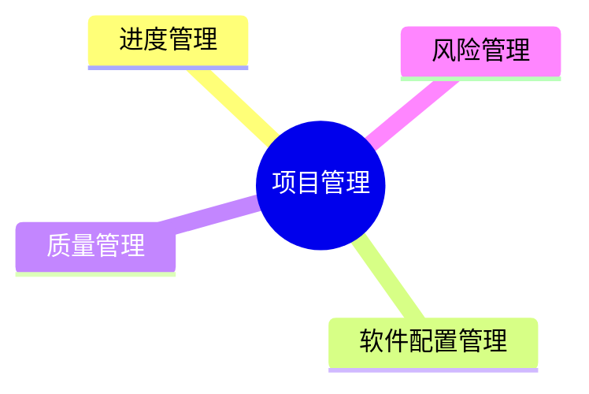

---
aliases:
  - 项目管理
tags:
  - system
  - comput
draft: false
date:
---
# MindMap

***
## 进度管理

> **进度管理：** 就是采用科学的方法，确定进度目标，编制进度计划和资源供应计划，进行进度控制，在与质量、成本目标协调的基础上，实现工期目标

### 进度管理涉及的过程

- 活动定义：确定完成项目各项可交付成果而需要开展的具体活动
- 活动排序：识别和记录各项活动之间的先后关系和逻辑关系
- 活动资源估算：估算完成各项活动所需要的资源类型和效益
- 活动历时估算：估算完成各项活动所需要的具体时间
- 进度计划编制：分析活动顺序、活动持续时间、资源要求和进度制约因素，制订项目进度计划
- 进度控制：根据进度计划开展项目活动，如果发现偏差，则分析原因或进行调整

### 工作分解结构(WBS)

> 工作分解结构(WBS)：就是把一个项目，按一定的原则分解成任务，任务再分解成一项项工作，再把一项项工作分配到每个人的日常活动中，直到分解不下去为止

**WBS常见的分解方式包括：** 按产品的物理结构分解、按产品或项目的功能分解、按照实施过程分解、按照项目的实施单位分解、按照项目的目标分解、按部分或职能进行分解等

### 甘特图和项目计划评审技术图

***Gantt图(甘特图)***

***项目计划评审技术图(Program Evaluation & Review Technique, PERT)***

**关键路径：** 是项目的最短工期，但却是**从开始到结束时间最长的路径**。进度网络图中可能有多条  
关键路径，因为活动会变化，因此关键路径也在不断变化中

> [!cite] **关键活动：** 关键路径上的活动
> 最早开始时间 = 最晚开始时间

**通常，每个节点的活动会有如下几个时间：**  

- 最早开始时间(ES): 某项活动能够开始的最早时间
- 最早结束时间(EF): 某项活动能够完成的最早时间。EF=ES+工期
- 最迟结束时间(LF): 为了使项目按时完成，某项活动必须完成的最迟时间
- 最迟开始时间(LS): 为了使项目按时完成，某项活动必须开始的最迟时间。LS=LF-工期

> [!cite] **顺推公式**
>  最早开始 ES = 所有前置活动最早完成EF的最大值
>  最早完成 EF = 最早开始ES + 持续时间

>[!cite]  **逆推公式** 
> 最晚完成 LF = 所有后续活动最晚开始LS的最小值
> 最晚开始 LS = 最晚完成LF-持续事件

**总浮动时间(松弛时间):** 在不延误项目完工时间且不违反进度制约因素的前提下，活动可以从最早开始时间推迟或拖延的时间量，就是该活动的进度灵活性。正常情况下，关键活动的总浮动时间  
为零

>[!cite] **浮动时间公式**
>浮动时间 = 最迟开始LS - 最早开始ES 或 
>最迟完成LF - 最早完成EF 或 
>关键路径 - 非关键路径时长

**自由浮动时间：** 是指在不延误任何紧后活动的最早开始时间且不违反进度制约因素的前提下，活  
动可以从最早开始时间推迟或拖延的时间量

> [!cite] 公式
自由浮动时间 = 紧后活动最早开始时间的最小值 - 本活动的最早完成时间

<!-- *** 
## 软件配置管理

*** 
## 质量管理

*** 
## 风险管理

*** -->
