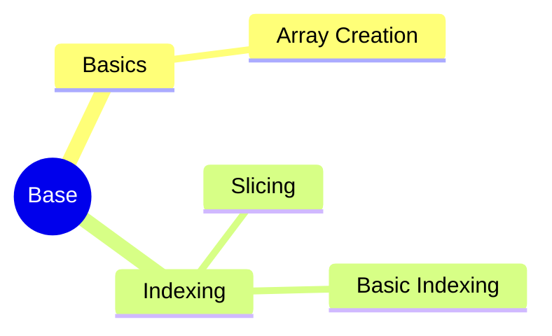

---
aliases:
  - 知识产权保护
tags:
  - system
  - comput
draft: false
date:
---
# MindMap

***
### 著作权

> [!quote] 根据《中华人民共和国著作权法》u3000第十九条 受委托创作的作品，著作权的归属由委托人和受托人通过合同约定。合同未作明确约定或者没有订立合同的，著作权属于受托人

X*公司接受Y公司的委托开发了一款应用软件，双方没有订立任何书面合同。然后X公司又接受Z公司的委托开发了同款应用软件，并在合同中注明著作权归属Z。在此情形下， **（Z公司 ）** 享有该软件的著作权*

> [!quote] 根据《计算机软件保护条例》第三十条,软件的复制品持有人不知道也没有合理理由应当知道该软件是侵权复制品的,不承担赔偿责任；但是，应当停止使用、销毁侵权复制品

某公司的用户购买了一台预先安装了操作系统的PC，后经查实，该PC上的操作系统是盗版，而对此情况该用户并不知情，则（ **应由该PC的提供者承担侵权责任）**

