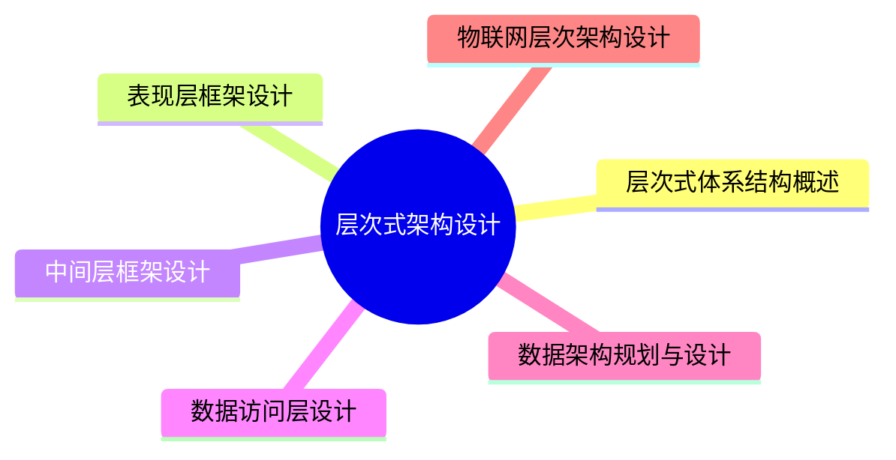

# MindMap

### 层次式体系结构概述

#### 定义

> 软件体系结构为软件系统提供了结构、行为和属性的高级抽象，由构成系统的元素描述这些元素的相互作用、指导元素集成的模式以及这些模式的约束组成。
> 
> 层次式体系结构设计是一种常见的架构设计方法，它将系统组成为一个层次结构，每一层为上层服务，并作为下层客户。在一些层次系统中，除了一些精心挑选的输出函数外，内部的层接口只对相邻的层可见。
> 
> 层次式体系结构的每一层最多只影响两层，同时只要给相邻层提供相同的接口，也允许每层用不同的方法实现，这种方式也为软件重用提供了强大的支持

#### 层次式应用的组成

大部分的应用会分成表现层（或称为展示层）、中间层（或称为业务层）、访问层（或称为持久
层）和数据层

### 表现层框架设计

#### MVC（Model-View-Controller）模式

MVC 是一种软件设计模式。MVC 把一个应用的输入、处理、输出流程按照视图、控制、模型的方式进行分离，形成了控制器、模型、视图 3 个核心模块。其中：

- 控制器（Controller）：接受用户的输入，并调用模型和视图去完成用户的需求
- 模型（Model）：应用程序的主体部分，表示业务数据和业务逻辑
- 视图（View）：用户看到并与之交流的界面

<!-- ### 中间层框架设计
### 数据访问层设计
### 数据架构规划与设计
### 物联网层次架构设计 
 -->
