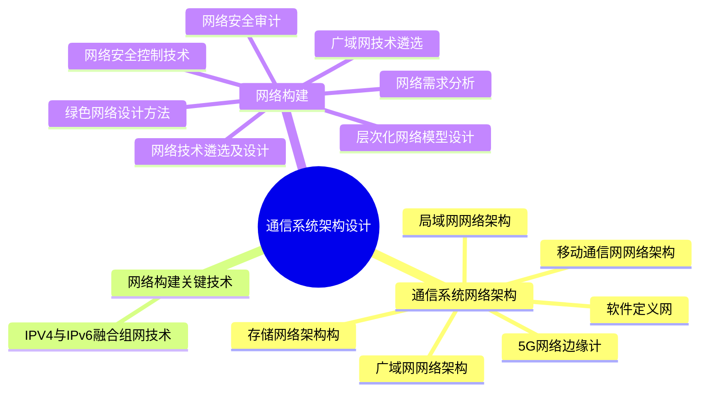

# MindMap


## 通信系统网络架构
### 局域网网络架构

> 局域网是单一机构专用计算机的网络。通常由计算机、交换机、路由器等设备组成。特点是覆盖地理范围小、数据传输速率高、低误码率、可靠性高、支持多种传输介质、支持实时应用。局域网按网络拓扑分类有总线型、环型、星型、树型、层次型等类型，按传输介质分类有有线局域网、无线局域网

| 架构    | 架构描述                                                        | 优点                                           | 缺点                                        |
|-------|-------------------------------------------------------------|----------------------------------------------|-------------------------------------------|
| 单核心架构 | 使用单台核心二层或三层交换设备作为网络核心。                                      | 结构简单，设备投资节约，接入方便。                            | 地理范围受限，核心单点故障，扩展能力有限，接入设备较多时核心端口密度要求高。    |
| 双核心架构 | 采用两台核心三层及以上交换机作为网络核心。                                       | 网络拓扑结构可靠性高，接入较为方便。                           | 投资较单核心高，核心端口密度要求较高。                       |
| 环型架构  | 采用多台核心三层及以上交换机组成双动态弹性分组环（Resilient Packet Ring，RPR），作为网络核心。 | RPR 具备自愈保护，节省光纤资源，提供多等级、可靠的 QoS 服务，有效利用带宽资源。 | 投资较高，路由冗余设计实施难度较高且易形成环路，多环智能通过业务接口互通无法直通。 |
| 层次型架构 | 由核心层、汇聚层、接入层三层交换设备和用户设备组成层次模型。                              | 易扩展，分级排查网络故障便于维护。                            | 无具体缺点描述。                                  |

### 广域网网络架构

>广域网利用公用分组交换网、无线分组交换网、卫星通信网构建通信子网连接分布的局域网以实现资源子网的共享。广域网由骨干网、分布网、接入网组成

| 架构名称    | 架构描述                                                   | 优点                              | 缺点                                         |
|---------|--------------------------------------------------------|---------------------------------|--------------------------------------------|
| 单核心架构   | 以单台核心三层交换设备作为网络核心。                                     | 结构简单，设备投资节约，局域网互访效率高，新局域网接入方便。  | 核心单点故障，扩展能力欠佳，核心设备端口密度要求较高。                |
| 双核心架构   | 以两台核心三层及以上交换机作为网络核心。                                   | 网络拓扑结构可靠，路由可热切换，可靠性高，局域网接入较为方便。 | 投资较单核心高，路由冗余设计实施难度较高，核心端口密度要求较高。           |
| 环型架构    | 以多台核心三层及以上交换机组成路由环路作为网络核心。                             | 接入方便。                           | 投资较高，路由冗余设计实施难度较高且易形成环路，核心端口密度要求较高。        |
| 半/全冗余架构 | 以多台核心路由设备间互连组成网络核心。若任意核心存在两条以上链路为半冗余架构，若核心间均有链路为全冗余架构。 | 结构灵活，路由灵活，方便扩展，可靠性高。            | 结构零散，不便管理，不便排障。                            |
| 对等子域架构  | 将半冗余核心划为两个独立子域，子域间通过一条或多条链路互连。                         | 路由控制灵活。                         | 子域间冗余设计实施难度较高，易形成环路或存在非法路由风险，子域互连设备性能要求高。  |
| 层次子域架构  | 半冗余核心划为多个独立子域，子域间存在层次关系，高层次子域连接多个低层次子域。                | 扩展性较好，路由控制灵活。                   | 子域路由冗余设计实施难度较高，易形成环路或存在非法路由风险，子域互连设备性能要求高。 |


### 移动通信网网络架构

5G 系统为移动终端用户提供数据网络互连，数据网络可以是互联网、IP 媒体子系统、专用网络。用户设备通过 5G 系统接入数据网络的方式有`透明模式`和`非透明模式`。在透明模式下 5G 系统通过用户面功能接口接入运营商网络，然后通过防火墙或者代理连至 Internet。非透明模式下，5G 系统可以直接或通过其他网络连接至运营商网络或 Internet
### 软件定义网络

[[软件定义网络（SDN, Software Defined Network）]]是一种新型网络创新架构，核心思想是通过控制与转发分离，将网络中交换设备的控制逻辑集中到一个计算设备上，控制面集中管控，提升网络管理配置能力

### 存储网络架构

| 对比项  | DAS             | NAS                        | SAN                  |
|------|-----------------|----------------------------|----------------------|
| 架构类别 | 单机存储架构          | 网络存储架构                     | 网络存储架构               |
| 访问方式 | I/O 总线          | 网络                         | 网络                   |
| 资源利用 | 单机存储            | 共享存储                       | 共享存储                 |
| 访问媒介 | 总线              | 以太网                        | 以太网/光纤通道             |
| 优势特点 | 易用易管理<br/>设备成本低 | 易用易管理<br/>可扩展性高<br/>设备成本较低 | 高性能<br/>低延迟<br/>灵活性高 |

## 网络构建关键技术
### IPV4与IPv6融合组网技术

> [!abstract] 
> 目前网络演进还存在较长时间 IPv4 到 IPv6 过渡期或 IPv4 和 IPv6 网络共存期


现阶段主要存在 3 种过渡技术：双协议栈、隧道技术、网络地址翻译技术

- **双协议栈**：两种协议在同一平台上双栈共存，同时运行
- **隧道技术**：包括 ISATAP 隧道、6to4 隧道、over6 隧道、6over4 隧道
- **网络地址翻译**（Network Address Translator，NAT）技术：将 IPv4 地址和 IPv6 地址分别看作内部地址和外部地址，或者相反，以实现地址转换
***
## 网络构建

**网络需求分析**：主要从业务需求、用户需求、应用需求、计算机平台需求和网络需求来进行分析

**网络技术遴选及设计**：可以使用生成树协议、虚拟局域网（VLAN）、无线局域网（WLAN）、线路冗余设计、服务器冗余设计等方式

**广域网技术遴选：** 可以采用远程接入技术、广域网互连技术，如数字数据网络（DDN）、同步数字体系（SDH）、多业务传送平台（MSTP）、虚拟专用网络（VPN）等。广域网性能优化策略有：预留带宽、利用拨号线路、传输数据压缩、链路聚合、数据基于优先级排序、基于协议预留带宽等方式

### 层次化网络模型设计

**层次化设计**：的优点是能降低成本，充分利用模块化设备/部件，网络变化或演化容易。层次化网络设计一般采用三层模型设计思路：**接入层**、**汇聚层**、**核心层**

***层次化设计的原则：***
- 控制网络层次
- 从接入层开始，向上分析规划
- 尽量采用模块化设计
- 严格控制网络结构
- 严格控制层次化结构
### 网络安全控制技术

- 防火墙：网络间的安全屏障，可以保护本地网络资源。防火墙可以允许/拒绝/ 重定向数据流以及审计进出网络的访问或服务 
	- 防火墙的体系有：硬件防火墙、软件防火墙、嵌入式防火墙。防火墙的种类有包过滤、应用层网关、代理服务等
	
- 虚拟专用网络技术
	- 利用公共网络建立私有专用网络，具有成本低、接入方便、可扩展性强、管理和控制方便等优点

- 访问控制技术
	- 自主访问控制（DAC）、强制访问控制（MAC）、基于角色的访问控制（RBAC）、基于任务的访问控制（TBAC）和基于对象的访问控制（OBAC）

- 网络安全隔离：将攻击隔离在网络外，保证网络内信息不外泄
	- 形式有：子网隔离、物理隔离、VLAN 隔离、逻辑隔离

- 网络安全协议

网络安全审计：用来测试，评估和分析网络脆弱性，能够实现自动响应、数据生成、分析、浏览、事件存储、事件选择等功能

绿色网络设计：采用精简设计、重用设计、回收设计的思路

>[!note] 
>通信网络主要形式：局域网、广域网、移动通信网

<!-- ```mermaid
graph LR
    A[] --> B[]
    B --> C[]
    C --> D[]
    D --> E[]
    E --> F[]
    F --> G[]

	B -.-> |O:N| D
``` -->
