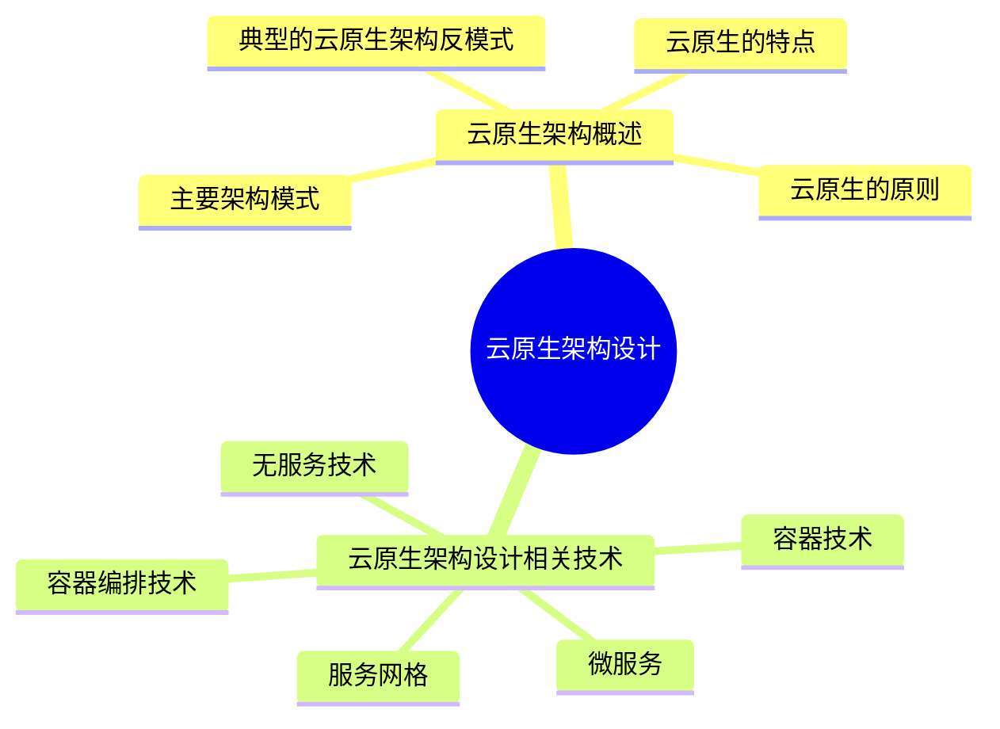

# MindMap

## 云原生架构概述
#### 定义

> 云原生架构是基于云原生技术的一组架构原则和设计模式的集合，旨在将云应用中的非业务代码部分进行最大化地剥离，从而让云设施接管应用中原有的大量非功能特性（如弹性、韧性、安全、可观测性、灰度等），使业务不再有非功能性业务中断困扰的同时，具备轻量、敏捷、高度自动化的特点
#### 云原生的特点

- **代码结构发生巨大变化**：不再需要掌握文件及其分布式处理技术，不再需要掌握各种复杂的网络技术，简化让业务开发变得更敏捷、更快速。 
- **非功能性特性大量委托给云原生架构来解决**：比如高可用能力、容灾能力、安全特性、可运维性、易用性、可测试性、灰度发布能力等。 
- **高度自动化的软件交付**：基于云原生的自动化软件交付可以把应用自动部署到成千上万的节点上

#### 云原生的原则

- 服务化原则：通过服务化架构把不同生命周期的模块分离出来，分别进行业务迭代
- 弹性原则：弹性是指系统的部署规模可以随着业务量的变化而自动伸缩
- 可观测原则：通过日志、链路跟踪和度量等手段，使得多次服务调用的耗时、返回值和参数都清晰可见
- 韧性原则：软件所依赖的软硬件组件出现各种异常时，软件表现出来的抵御能力
- 所有过程自动化原则：让自动化工具理解交付目标和环境差异，实现整个软件交付和运维的自动化
- 零信任原则：不应该信任网络内部和外部的任何人/设备/系统，需要基于认证和授权重构访问控制的信任基础
- 架构持续演进原则：架构具备持续演进能力
#### 主要架构模式

- 服务化架构模式：要求以应用模块为颗粒度划分一个应用软件，以接口契约（例如 IDL）定义彼此业务关系，以标准协议（HTTP、gRPC 等）确保彼此的互联互通，结合领域模型驱动（Domain Driven Design，DDD）、测试动开发（Test Driven Design，TDD）、容器化部署提升每个接口的代码质量和迭代速度

- Mesh 化架构模式：Mesh 化架构是把中间件框架（如 [[RPC（Remote Procedure Call）|RPC]]、缓存、异步消息等）从业务进程中分离，让中间件 SDK 与业务代码进一步解耦，从而使得中间件升级对业务进程没有影响，甚至迁移到另外一个平台的中间件也对业务透明

- Serverless 模式：业务流量到来/业务事件发生时，云会启动或调度一个已启动的业务进程进行处理，处理完成后云自动会关闭/调度业务进程，等待下一次触发。开发者不用关心应用运行地点、操作系统、网络配置、CPU 性能等，将应用的整个运行都委托给云。Serverless 模式适合事件驱动的数据计算任务、计算时间短的请求/响应应用、没有复杂相互调用的长周期任务

- 存储计算分离模式：分布式环境中的 [[CAP（CAP theorem）|CAP]] 困难主要是针对有状态应用，由于一致性（Consistency，C），可用性（Availability，A），分区容错性（Partition Tolerance，P）三者无法同时满足，最多满足其中两个。所以无状态应用不存在一致性这个维度，可以获得很好的可用性和分区容错性，因而获得更好的弹性

- 分布式事务模式：由于业务需要访问多个微服务，所以会带来分布式事务问题，否则数据就会出现不一致。因此架构师需要根据不同的场景选择合适的分布式事务模式

- 事件驱动架构：事件驱动架构（Event Driven Architecture，EDA）是一种应用/组件间的集成架构模式。适用于增强服务韧性、数据变化通知、构建开放式接口、事件流处理、命令查询的责任分离（Command Query Responsibility Segregation，CQRS）把对服务状态有影响的命令用事件来发起，而对服务状态没有影响的查询才使用同步调用的 API 接口等
#### 典型的云原生架构反模式

- 庞大的单体应用：缺乏依赖隔离，代码耦合，责任和模块边界不清晰，模块间接口缺乏治理，变更影响扩散，不同模块间的开发进度和发布时间要求难以协调，一个子模块不稳定导致整个应用都变慢，扩容时只能整体扩容而不能对达到瓶颈的模块单独扩容等
- 单体应用“硬拆”为微服务：强行把耦合度高、代码量少的模块进行服务化拆分；拆分后服务的数据是紧密耦合的；拆分后成为分布式调用，严重影响性能
- 缺乏自动化能力的微服务：人均负责模块数上升，人均工作量增大，也增加了软件开发成本
***
## 云原生架构设计相关技术
#### 容器技术

容器作为标准化软件基础单元，它将应用及其所有依赖项打包发布，由于依赖项齐备，应用不再受环境限制，在不同计算环境间快速、可靠地运行
#### 容器编排技术

容器编排技术包括资源调度、应用部署与管理、自动修复、服务发现与负载均衡、弹性伸缩、 声明式 API、可扩展性架构、可移植性
#### 微服务

微服务模式将后端单体应用拆分为松耦合的多个子应用，每个子应用负责一组子功能。这些子应用称为“微服务”，多个“微服务”共同形成了一个物理独立但逻辑完整的分布式微服务体系。这些微服务相对独立，通过解耦研发、测试与部署流程，提高整体迭代效率。微服务设计约束如下： 

- **微服务个体约束**：微服务应用的功能在业务领域划分上应是相互独立的
- **微服务与微服务之间的横向关系**：在合理划分好微服务间的边界后，从可发现性和可交互性处理微服务间的横向关系。可发现性是指当服务 A 发布和扩/缩容的时候，依赖服务 A 的服务B 在不重新发布的前提下，能够自动感知到服务 A 的变化。可交互性是指服务 A 采用什么样的方式可以调用服务 B
- **微服务与数据层之间的纵向约束**：提倡数据存储隔离（Data Storage Segregation，DSS）原则，对于数据的访问都必须通过相对应的微服务提供的 API 来访问
- **全局视角下的微服务分布式约束**：高效运维整个系统，从技术上实现全自动化的 CI/CD 流水线满足对开发效率的诉求，并在这个基础上支持蓝绿、金丝雀等不同发布策略，以满足对业务发布稳定性的诉求
#### 无服务技术

**无服务器技术的特点：**

- 全托管的计算服务—客户只需要编写代码构建应用，无须关注同质化的、负担繁重的基于服务器等基础设施的开发、运维、安全、高可用等工作
- 通用性—结合云 BaaS（后端云服务）API 的能力，能够支撑云上所有重要类型的应用
- 自动弹性伸缩—让用户无须为资源使用提前进行容量规划
- 按量计费—让企业的使用成本有效降低，无须为闲置资源付费 

无服务器技术的关注点是：计算资源弹性调度（容错、资源利用率、性能、数据驱动）、负载
均衡和流控、安全性
#### 服务网格

服务网格旨在将那些微服务间的连接、安全、流量控制和可观测等通用功能下沉为平台基础设施，实现应用与平台基础设施的解耦

服务网格的主要技术：Istio、Linkerd、Consul

