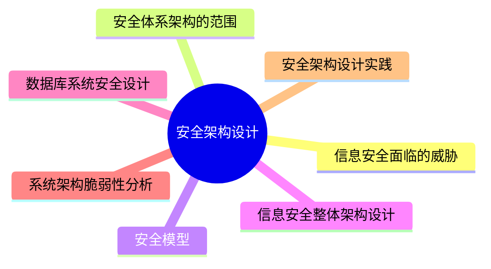

# MindMap

## 信息安全面临的威胁 

**信息系统安全威胁的来源**： 威胁可以来源于物理环境、通信链路、网络系统、操作系统、应用系统、管理系统

**网络与信息安全风险类别**：可以分为人为蓄意破坏（被动型攻击，主动型攻击）、灾害性攻击、系统故障、人员无意识行为
*** 
## 安全体系架构的范围

- 安全防线：分别是产品安全架构、安全技术架构、审计架构
- 安全架构特性：可用性、完整性、机密性的特性
- 安全技术架构主要包括：身份鉴别、访问控制、内容安全、冗余恢复、审计响应、恶意代码防范、密码技术
*** 
## 安全模型

>[!important] 信息系统安全目标是控制和管理主体对客体的访问
### 典型安全模型

- 状态机模型
- BLP 模型（Bell-LaPadula Model）：该模型为数据规划机密性，依据机密性划分安全级别，按安全级别强制访问控制
- Biba 模型：建立在完整性级别上。模型具有完整性的三个目标：保护数据不被未授权用户更改、保护数据不被授权用户越权修改（未授权更改）、维持数据内部和外部的一致性
- CWM 模型（Clark-Wilson Model）：将完整性目标、策略和机制融为一体，提出职责分离目标，应用完整性验证过程，实现了成型的事务处理机制，常用于银行系统
- Chinese Wall 模型，是一种混合策略模型，应用于多边安全系统，防止多安全域存在潜在的冲突。该模型为投资银行设计，常见于金融领域。工作原理是通过自主访问控制（DAC）选择安全域，通过强制访问控制（MAC）完成特定安全域内的访问控制
*** 
## 信息安全整体架构设计

WPDRRC 信息安全模型：包括 6 个环节：预警（Warning）、保护（Protect）、检测（Detect）、响应（React）、恢复（Restore）、反击（Counterattack）；3 个要素：人员、策略、技术。

**信息安全体系架构**

***
## 网络安全架构设计

- OSI 定义了分层多点的安全技术体系架构，又叫深度防御安全架构，它通过以下 3 种方式将防御能力分布至整个信息系统中。 

- 多点技术防御：通过网络和基础设施，边界防御（流量过滤、控制、如前检测），计算环境等方式进行防御

- 分层技术防御：外部和内部边界使用嵌套防火墙，配合入侵检测进行防御

- 支撑性基础设施：使用公钥基础设施以及检测和响应基础设施进行防御

- 认证框架：认证又叫鉴权，其目的是防止其他实体占用和独立操作被鉴别实体的身份。鉴别的方式有

- 访问控制框架：当发起者请求对目标进行特殊访问时，访问控制管制设备（Access Control Enforcement Facilities，AEF）就通知访问控制决策设备（Access Control Decision Facilities，ADF），ADF 可以根据上下文信息（包括发起者的位置、访问时间或使用中的特殊通信路径）以及可能还有以前判决中保留下来的访问控制决策信息（Access Control Decision Information，ADI）做出允许或禁止发起者试图对目标进行访问的判决

- 机密性框架：目的是确保信息仅仅是对被授权者可用。机密性机制包括：通过禁止访问提供机密性、通过加密提供机密性

- 完整性框架：完整性服务目的是组织威胁或探测威胁，保护数据及其相关属性的完整性。完整性服务分类有：未授权的数据创建、数据创建、数据删除、数据重放。完整性机制类型分为阻止媒体访问与探测非授权修改两种

- 抗抵赖框架服务的目的：是提供特定事件或行为的证据。抗抵赖服务阶段分为：证据生成、证据传输、存储及回复、证据验证、解决纠纷这 5 个阶段
*** 
## 数据库系统安全设计 

### 数据库完整性设计原则 

- 依据完整性约束类型设计其实现的系统层次和方式，并考虑性能
- 在保障性能的前提下，尽可能应用实体完整性约束和引用完整性约束
- 慎用触发器
- 制订并使用完整性约束命名规范
- 测试数据库完整性，尽早排除冲突和性能隐患
- 设有数据库设计团队，参与数据库工程全过程
- 使用 CASE 工具，降低工作量，提高工作效率

### 数据库完整性的作用

- 防止不合语义的数据入库
- 降低开发复杂性，提高运行效率
- 通过测试尽早发现缺陷
*** 
## 系统架构脆弱性分析 

### 系统架构脆弱性组成 

系统架构脆弱性包括物理装备脆弱性、软件脆弱性、人员管理脆弱性、规章制度脆弱性、安全策略脆弱性等

### 典型架构的脆弱性表现 

- 分层架构
	- 层间脆弱性：一旦某个底层发生错误，那么整个程序将会无法正常运行
	- 层间通信脆弱性：如在面向对象方法中，将会存在大量对象成员方法的调用（消息交互），这种层层传递，势必造成性能的下降

- C/S 架构
	- 客户端脆弱性、网络开放性脆弱性、网络协议脆弱性

- B/S 架构
	- 如果 B/S 架构使用的是 HTTP 协议，会更容易被病毒入侵

- 事件驱动架构
	- 组件脆弱性、组件间交换数据的脆弱性、组件间逻辑关系的脆弱性、事件驱动容易死循环、高并发脆弱性、固定流程脆弱性

- MVC 架构
	- 复杂性脆弱性
	- 视图与控制器连接紧密脆弱性
	- 视图对模型低效率访问脆弱性

- 微内核架构
	- 整体优化脆弱性
	- 进程通信开销脆弱性
	- 通信损失脆弱性

- 微服务架构
	- 分布式结构复杂带来的脆弱性
	- 服务间通信带来的脆弱性
	- 服务管理复杂性带来的脆弱性
*** 
## 安全架构设计实践

### 远程认证拨号用户服务（Remote Authentication Dial-In User Service，RADIUS） 

RADIUS 是应用最广泛的高安全级别认证、授权、审计协议（Authentication，Authorization，Accounting，AAA），具有高性能和高可扩展性，且可用多种协议实现

RADIUS 通常由协议逻辑层，业务逻辑层和数据逻辑层 3 层组成层次式架构
- 协议逻辑层：起到分发处理功能，相当于转发引擎
- 业务逻辑层：实现认证、授权、审计三种类型业务及其服务进程间的通信
- 数据逻辑层：实现统一的数据访问代理池，降低数据库依赖，减少数据库压力，增强系统的数据库适应能力
