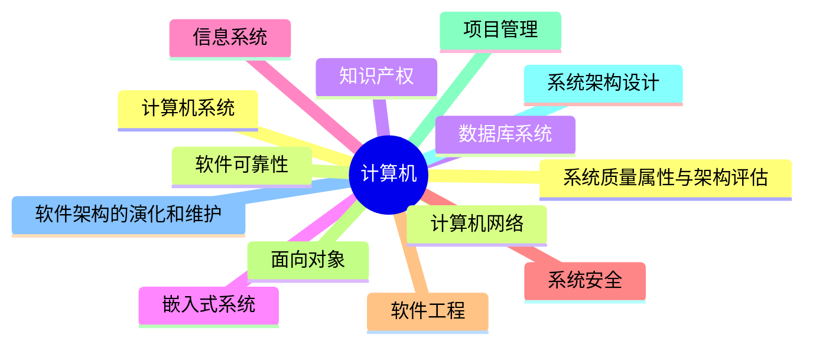

---
tags:
  - system
draft: true
public: false
---

```mermaid
mindmap
  root((计算机))
    计算机系统
    计算机网络
    数据库系统
    嵌入式系统
    信息系统
    系统安全
    软件工程
    面向对象
    项目管理
    系统架构设计
    软件架构的演化和维护
    系统质量属性与架构评估
    软件可靠性
    知识产权
```