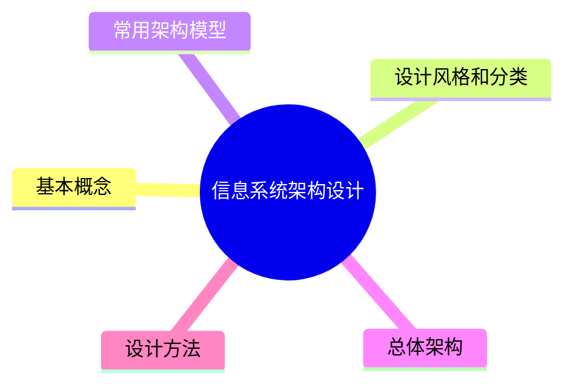

---
aliases:
  - 信息系统架构
  - Information System Architecture
  - ISA
tags:
  - system
  - comput
draft: false
date:
---
# MindMap

> 信息系统架构（Information System Architecture，ISA）是一种总体架构，其自顶向下体现政府、企（事）业单位的信息系统的各个组成部分和各部分之间的关系，表现为信息系统与相关业务的关系，体现了信息系统与信息技术的关系，是展示了信息、技术与企业及其业务之间关系的模型。 

<!-- 
*** 
## 基本概念
*** 
## 设计风格和分类
*** 
## 常用架构模型
*** 
## 总体架构
*** 
## 设计方法

***
## Reference -->
