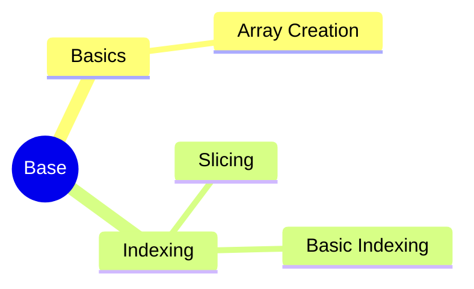

# MindMap

```mermaid
mindmap
  root((Base))
    Basics
      Array Creation
    Indexing
      Basic Indexing
      Slicing
```
***

***
## Reference

- [♥分布式系统 - 知识体系详解♥ | Java 全栈知识体系](https://pdai.tech/md/arch/arch-z-overview.html)