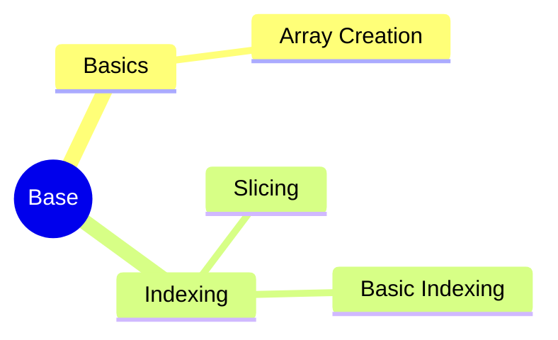

---
aliases:
  - 架构模式
  - Architecture Pattern
  - AP
tags:
  - system
  - comput
draft: true
date:
---
# MindMap


***


***
## Reference

```mermaid
graph LR
    A[] --> B[]
    B --> C[]
    C --> D[]
    D --> E[]
    E --> F[]
    F --> G[]

	B -.-> |O:N| D
```
