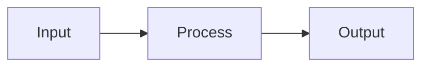

---
title:
date: 2024-01-09
aliases:
tags:
  - bigdata
description:
language: EN
draft:
type: concept
dcmm_domain:
dama_area:
cdo_value:
status: seed
publishDate: <%tp.date.now("YYYY-MM-DD")%>T<%tp.date.now("HH:mm")%>
---

## Definition

## Business Value

## Architecture / Flow

## Commercial Practice

## Common Pitfalls

## Interview Answer

## Links

- part-of::
- depends-on::
- supports::
- compares-with::
