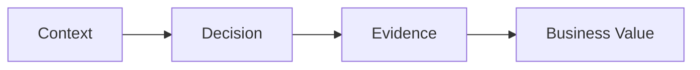

---
title:
date: 2026-06-14
aliases:
tags:
  - interview
description:
publish: true
type: interview-answer
status: seed
related_capability:
project_evidence:
---

## Question

## Short Answer

## Context

## Principle

## Architecture / Tradeoff

## Project Evidence

## Common Follow-up Questions

## Links

- part-of:: [[Bigdata Interview Question Bank]]
- based-on::
- used-in::

